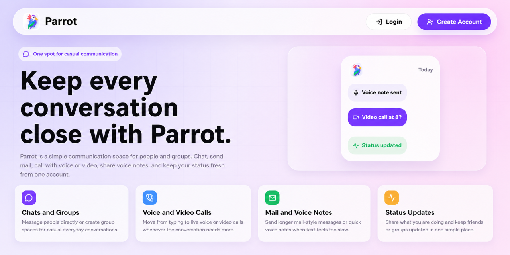
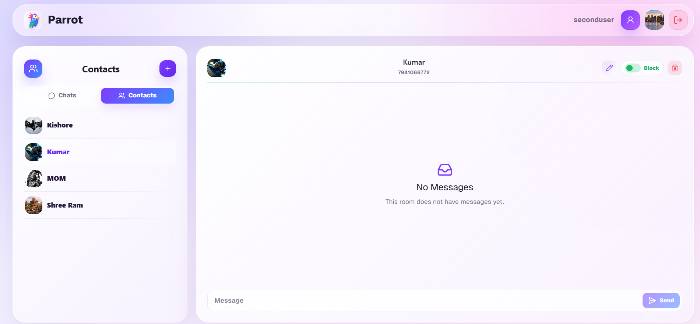
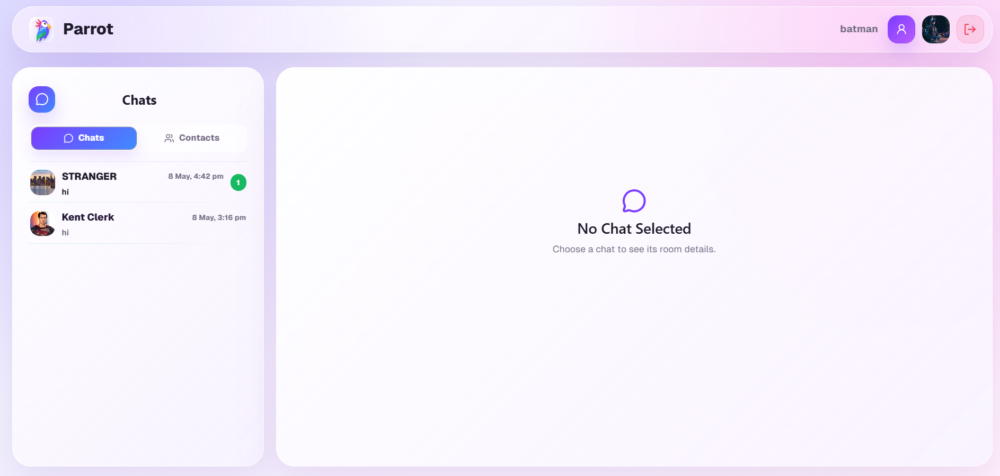
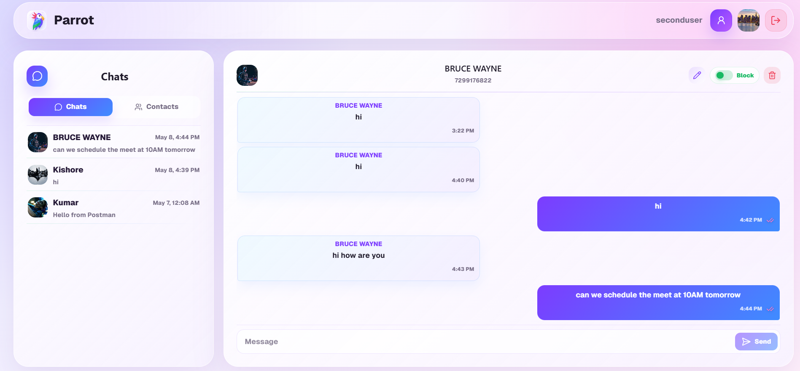

# 🦜 Parrot - Unified Communication Platform

> **One spot for casual communication** 
>
> A comprehensive **multi-service architecture** for user management, real-time messaging, and a modern frontend interface. Parrot enables secure authentication, profile management, contact management, and real-time message delivery across web.

---

## 📸 Screenshots

### Parrot Interface Gallery

Explore the intuitive and modern user interface of Parrot:

| | | |
|:-:|:-:|:-:|
| <br>**Home Screen** | <br>**Login & Auth** | <br>**Chat Interface** |
| <br>**Chat Room** | | |

---

## 🔗 Live Links & Repositories

| Service | Live Link | Repository |
|---------|-----------|-----------|
| 🎨 **React Frontend** | [Live App](https://parrot-react.onrender.com/) | [parrot-react](https://github.com/Kishore-83096/parrot-react) |
| 👤 **Parent Service** | [API Docs](https://github.com/Kishore-83096/Parent/blob/main/README.md) | [parrot-parent](https://github.com/Kishore-83096/Parent) |
| 💬 **Messenger Service** | [API Docs]->work pending | [parrot-messenger](https://github.com/Kishore-83096/Parrot-messenger) |

---

## 📋 Table of Contents

- [Screenshots](#screenshots)
- [Project Overview](#project-overview)
- [Architecture](#architecture)
- [Services](#services)
- [Technology Stack](#technology-stack)
- [Module Breakdown](#module-breakdown)
- [Installation & Setup](#installation--setup)
- [Running the Services](#running-the-services)
- [Deployment](#deployment)
- [API Documentation](#api-documentation)
- [Security](#security)
- [Contributing](#contributing)

---

## 🎯 Project Overview

**Parrot** is a distributed microservices platform designed to handle:

- **Authentication & Authorization**: JWT-based user authentication
- **Profile Management**: User profile, avatar, and metadata management
- **Contact Management**: Add, update, block, and manage user contacts
- **Real-Time Messaging**: WebSocket-based message delivery with authorization
- **Frontend Interface**: Modern React application for both Parent and Messenger services

### Key Features

✅ **User registration and authentication** with JWT tokens  
✅ **Profile management** with image upload support  
✅ **Contact addition and management** - save, update, block/unblock  
✅ **Real-time messaging** with WebSocket support  
✅ **Message persistence** and retrieval from database  
✅ **User blocking/unblocking** functionality for user control  
✅ **Internal service authorization** - service-to-service authentication  
✅ **REST API with JWT authentication** - Secure endpoints  
✅ **Docker support** for all microservices  
✅ **Environment-based configuration** - Easy deployment

---

## 🏗️ Architecture

### System Architecture Diagram

```
┌────────────────────────────────────────────────────────────────────────────────────┐
│                                  CLIENT LAYER                                      │
│  ┌─────────────────────────────────────────────────────────────────────────────┐   │
│  │                      React Frontend (TypeScript + Vite)                     │   │
│  │                      🎨 Port: 5173 (dev) | 80 (prod)                        │   │
│  │  ┌──────────────────────┐    ┌──────────────────────┐                       │   │
│  │  │   Parent App         │    │   Messenger App      │                       │   │
│  │  │  • Auth Pages        │    │  • Chat Interface    │                       │   │
│  │  │  • Profile Mgmt      │    │  • Message Display   │                       │   │
│  │  │  • Contact List      │    │  • Real-time Updates │                       │   │
│  │  └──────────────────────┘    └──────────────────────┘                       │   │
│  └─────────────┬──────────────────────────┬──────────────────────────────────  ┘   │
└────────────────┼──────────────────────────┼──────────────────────────────────  ────┘
                 │ REST API                 │ REST + WebSocket
                 │ (Axios/TanStack Query)   │ (Real-time Connection)
                 │                          │
┌────────────────┼──────────────────────────┼──────────────────────────────────────┐
│  API LAYER     │                          │                                      │
│  ┌─────────────▼──────────┐   ┌──────────▼──────────────┐                        │
│  │  Parent Service        │   │  Messenger Service      │                        │
│  │  Flask + REST          │   │  Django + Channels      │                        │
│  │  🔵 Port: 5000         │   │  🟣 Port: 8000          │                       │
│  ├────────────────────────┤   ├─────────────────────────┤                        │
│  │ ✓ User Registration    │   │ ✓ WebSocket Handler     │                       │
│  │ ✓ JWT Authentication   │   │ ✓ Message Broker        │                       │
│  │ ✓ Profile Management   │   │ ✓ Room Management       │                       │
│  │ ✓ Contact Management   │   │ ✓ Real-time Sync        │                       │
│  │ ✓ Image Upload         │   │ ✓ Message Persistence   │                       │
│  │ ✓ Service Authorization│   │ ✓ Participant Tracking  │                       │
│  └────────────┬───────────┘   └──────────┬──────────────┘                        │
│               │                          │                                       │
│               │ Internal Service Token   │ HTTP (Service-to-Service)             │
│               │◄─────────────────────────┤                                       │
└───────────────┼──────────────────────────┼────────────────────────────────────── ┘
                │                          │
┌───────────────┼──────────────────────────┼─────────────────────────────────── ───┐
│  DATA LAYER   │                          │                                       │
│  ┌────────────▼────────────┐   ┌────────▼────────────────── ┐                    │
│  │  PostgreSQL Database    │   │  PostgreSQL + Redis        │                    │
│  │  🗄️  User Data         │    │  🗄️  Message Data         │                    │
│  │  🗄️  Profile Data      │    │  📢 Message Queue         │                    │
│  │  🗄️  Contact Data      │    │  🔴 Session Store         │                    │
│  │  🗄️  Auth Tokens       │    │  🔴 Real-time Cache       │                    │
│  │  🗄️  Cloudinary Links  │    │  🔴 Room State            │                    │
│  └────────────────────────┘    └────────────────────────────┘                    │
│                                                                                  │
│                                                                                  │
└──────────────────────────────────────────────────────────────────────────────────┘

┌──────────────────────────────────────────────────────────────────────────────────┐
│  MESSAGE FLOW & COMMUNICATION PATTERNS                                           │
├──────────────────────────────────────────────────────────────────────────────────┤
│                                                                                  │
│  AUTHENTICATION FLOW:                                                            │
│  Frontend → Parent Service (POST /auth/login)                                    │
│  ← Access Token + Refresh Token                                                  │
│  ← User Profile Data                                                             │
│                                                                                  │
│  MESSAGING FLOW:                                                                 │
│  Frontend → Messenger Service (WebSocket /ws/chat/<room_id>/)                    │
│  ← Real-time Message Updates                                                     │
│  ← Participant Join/Leave Events                                                 │
│  ← Online Status Changes                                                         │
│                                                                                  │
│  INTER-SERVICE COMMUNICATION:                                                    │
│  Messenger → Parent (X-Internal-Service-Token header)                            │
│  → Validate messaging pair authorization                                         │
│  ← User profile and permission details                                           │
│                                                                                  │
└──────────────────────────────────────────────────────────────────────────────────┘

┌──────────────────────────────────────────────────────────────────────────────────┐
│  DEPLOYMENT TOPOLOGY (Production)                                                │
├──────────────────────────────────────────────────────────────────────────────────┤
│                                                                                  │
│                                                                                  │
│  ┌──────────────┐  ┌──────────────┐  ┌──────────────┐                            │
│  │ React App    │  │ Parent API   │  │ Messenger    │                            │
│  │ CDN Cache    │  │ Gunicorn     │  │ Daphne ASGI  │                            │
│  │ Static Files │  │ 4 Workers    │  │ Auto-scaling │                            │
│  └──────────────┘  └──────────────┘  └──────────────┘                            │
│         │                    │                    │                              │
│         └────────┬───────────┴────────┬──────────┘                               │
│                  │                    │                                          │ 
│           ┌──────▼──────┐      ┌──────▼──────┐                                   │
│           │ PostgreSQL   │      │ Redis       │                                  │
│           │ Cluster      │      │ Cluster     │                                  │
│           │ (Primary +   │      │ (Master +   │                                  │
│           │  Replicas)   │      │  Replicas)  │                                  │
│           └──────────────┘      └─────────────┘                                  │
│                                                                                  │
└──────────────────────────────────────────────────────────────────────────────────┘
```

### Key Architecture Points

**Parrot follows a distributed microservices architecture with clear separation of concerns:**

| Layer | Component | Responsibility |
|-------|-----------|-----------------|
| **Frontend** | React (Vite) | User UI, Client-side routing, API integration |
| **API Gateway** | Nginx/CloudFlare | Load balancing, SSL/TLS, Rate limiting |
| **Services** | Parent + Messenger | Business logic, Authentication, Data validation |
| **Message Queue** | Redis/Channels | Real-time pub/sub, WebSocket management |
| **Storage** | PostgreSQL | Persistent data, Transactions, Backups |
| **Cache** | Redis | Session store, Rate limiting, Real-time state |
| **External** | Cloudinary | Image hosting, CDN delivery |

---

## 🔧 Services

### 1. **Parent Service** (Port: 5000)


#### Key Modules:

| Module | Purpose | Key Files |
|--------|---------|-----------|
| **Authentication** | User registration, login, JWT token generation | `routes.py`, `services.py`, `auth.py` |
| **Profile Management** | User profile CRUD operations, avatar management | `models.py`, `schema.py`, `services.py` |
| **Contact Management** | Save, update, delete, block/unblock contacts | `routes.py`, `services.py` |
| **Internal Authorization** | Service-to-service authentication | `routes.py`, `config.py` |
| **Caching** | In-memory caching for frequently accessed data | `cache.py` |
| **Error Handling** | Centralized error responses | `errors.py` |

#### API Endpoints:

```
POST   /auth/register              - User registration
POST   /auth/login                 - User login
POST   /auth/refresh               - Refresh JWT token
GET    /profile                    - Get user profile
PATCH  /profile                    - Update user profile
DELETE /profile/picture            - Remove profile picture
GET    /contacts                   - Get all saved contacts
POST   /contacts/search            - Search user by account number
POST   /contacts/save              - Save a contact
GET    /contacts/{contact_id}      - Get contact details
PATCH  /contacts/{contact_id}      - Update contact alias
DELETE /contacts/{contact_id}      - Delete contact
POST   /contacts/{contact_id}/block    - Block contact
POST   /contacts/{contact_id}/unblock  - Unblock contact
DELETE /account                    - Delete user account
POST   /internal/messaging/authorize   - Internal service authorization
```

#### Database Models:

- **User**: Account information, email, password hash
- **Profile**: Extended user information, bio, avatar URL
- **Contact**: Saved contacts with aliases and block status

---

### 2. **Messenger Service** (Port: 8000)

**Purpose**: Real-time message delivery, WebSocket management, and message persistence


#### Key Modules:

| Module | Purpose | Key Files |
|--------|---------|-----------|
| **Room Management** | Direct and group chat rooms | `models.py`, `views.py` |
| **Message Services** | Message creation, retrieval, and persistence | `services.py`, `models.py` |
| **WebSocket Support** | Real-time message delivery | `consumers.py`, `routing.py` |
| **Authorization** | Message access control and validation | `auth.py`, `consumers.py` |
| **Real-time Updates** | WebSocket event handling | `realtime.py`, `signals.py` |
| **Message History** | Message retrieval and persistence | `services.py`, `views.py` |

#### Key Features:

- **Room Types**: Direct (1-to-1) and Group chats
- **WebSocket Channels**: Real-time message synchronization
- **Message Types**: Text, media, system messages
- **Participant Management**: Active participants, join/leave events
- **Message Persistence**: Database storage with SQLite/PostgreSQL

#### Database Models:

- **Room**: Chat room configuration (direct/group)
- **Participant**: Room members and their activity status
- **Message**: Message content, sender, timestamp, read status

#### WebSocket Events:

```
ws://localhost:8000/ws/chat/<room_id>/
{
  "type": "chat_message",
  "sender_id": 123,
  "content": "Hello!",
  "timestamp": "2026-05-08T10:30:00Z"
}
```

---

### 3. **React Frontend** (Port: 5173 Dev / 80 Prod)

**Purpose**: Modern user interface for Parent and Messenger services


#### Key Modules:

| Module | Purpose | Location |
|--------|---------|----------|
| **Parent App** | Authentication, profile, contact management UI | `/src/parent/` |
| **Messenger App** | Chat interface, message display, real-time updates | `/src/messenger/` |
| **UI Components** | Reusable UI library (shadcn/ui) | `/src/components/ui/` |
| **API Layer** | HTTP client for Parent and Messenger services | `/src/parent/api.js`, `/src/messenger/api.js` |
| **Pages** | Page-level components for routing | `/src/parent/pages/`, `/src/messenger/pages/` |

#### Features:

- **Parent Interface**:
  - User registration and login
  - Profile creation and editing
  - Avatar upload
  - Contact search and management
  - Contact blocking/unblocking

- **Messenger Interface**:
  - Real-time chat with WebSocket
  - Direct and group messaging
  - Message history
  - Online status indicators
  - Message notifications

#### UI Library & Styling:

- **Framework**: React 19.2.5 with TypeScript
- **Build Tool**: Vite 8.0.10
- **CSS Framework**: Tailwind CSS 4.2.4
- **Component Library**: shadcn/ui (Radix UI)
- **Styling**: Tailwind Merge, Class Variance Authority
- **Animations**: Framer Motion 12.38.0

---

## 📚 Technology Stack

### **Parent Service (Flask)**

| Layer | Technology | Version |
|-------|-----------|---------|
| **Framework** | Flask | 3.1.3 |
| **API** | Flask-RESTful | 0.3.10 |
| **Database** | SQLAlchemy 2.0 | 2.0.49 |
| **Auth** | Flask-JWT-Extended | 4.7.1 |
| **Serialization** | Marshmallow | 4.3.0 |
| **Image Upload** | Cloudinary | 1.44.1 |
| **DB Driver** | psycopg2-binary | 2.9.11 |
| **CORS** | Flask-CORS | 6.0.2 |
| **Server** | Gunicorn / Waitress | 23.0.0 / 3.0.2 |

**Full Tech Stack**:
```
alembic, aniso8601, argon2-cffi, blinker, cffi, click, colorama,
cloudinary, flask, flask-cors, Flask-JWT-Extended, flask-marshmallow,
Flask-Migrate, Flask-RESTful, Flask-SQLAlchemy, greenlet, gunicorn,
itsdangerous, Jinja2, Mako, MarkupSafe, marshmallow, marshmallow-sqlalchemy,
passlib, Pillow, pycparser, PyJWT, python-dotenv, psycopg2-binary,
pytz, six, SQLAlchemy, typing_extensions, waitress, Werkzeug
```

### **Messenger Service (Django)**

| Layer | Technology | Version |
|-------|-----------|---------|
| **Framework** | Django | >=5.2, <6.1 |
| **REST API** | Django REST Framework | >=3.17, <4.0 |
| **WebSocket** | Django Channels | >=4.3, <5.0 |
| **ASGI Server** | Daphne | >=4.2, <5.0 |
| **Message Queue** | Channels-Redis | >=4.3, <5.0 |
| **Cache** | Redis | >=7.4, <8.0 |
| **Database** | PostgreSQL (psycopg2) | >=2.9, <3.0 |
| **HTTP Client** | httpx | >=0.28, <1.0 |
| **Auth** | PyJWT | >=2.10, <3.0 |
| **CORS** | django-cors-headers | >=4.7, <5.0 |
| **Config** | python-dotenv, dj-database-url | Latest |

**Full Tech Stack**:
```
Django, djangorestframework, channels, channels-redis, daphne,
psycopg2-binary, dj-database-url, python-dotenv, redis, httpx,
PyJWT, django-cors-headers
```

### **React Frontend (Vite + React)**

| Layer | Technology | Version |
|-------|-----------|---------|
| **Framework** | React | 19.2.5 |
| **Language** | TypeScript | ~6.0.2 |
| **Build Tool** | Vite | 8.0.10 |
| **Styling** | Tailwind CSS | 4.2.4 |
| **UI Components** | Radix UI | 1.4.3 |
| **Component Library** | shadcn/ui | Latest |
| **Routing** | React Router DOM | 7.14.2 |
| **HTTP Client** | Axios | 1.16.0 |
| **State Management** | TanStack React Query | 5.100.9 |
| **Form Handling** | React Hook Form | 7.75.0 |
| **Animations** | Framer Motion | 12.38.0 |
| **Icons** | Lucide React | 1.14.0 |
| **Validation** | Zod | 4.4.3 |
| **Notifications** | Sonner | 2.0.7 |
| **Theme** | next-themes | 0.4.6 |
| **Linter** | ESLint | 10.2.1 |

---

## 🔍 Module Breakdown

### Parent Service Modules

#### **1. Authentication Module** (`app/main/api/services.py`)
- User registration with email validation
- Password hashing using Argon2
- JWT token generation and refresh
- User login verification

#### **2. Profile Management Module**
- Update user profile (name, bio, preferences)
- Avatar upload to Cloudinary
- Profile picture deletion
- User profile retrieval

#### **3. Contact Management Module**
- Search users by account number
- Save contacts with custom aliases
- Update contact aliases
- Delete saved contacts
- Block/unblock contacts functionality

#### **4. Internal Authorization Module** (`routes.py`)
- Service-to-service authentication
- X-Internal-Service-Token validation
- Messaging pair authorization

#### **5. Caching Module** (`cache.py`)
- In-memory caching
- Frequently accessed data optimization
- Cache invalidation strategies

#### **6. Error Handling Module** (`errors.py`)
- Centralized error responses
- Custom exception definitions
- Error message formatting

---

### Messenger Service Modules

#### **1. Room Management Module** (`models.py`)
- Direct chat room creation
- Group chat support
- Room metadata and timestamps
- Participant count tracking

#### **2. Message Services Module** (`services.py`)
- Message creation and validation
- Message retrieval with pagination
- Message update and deletion
- Read status tracking

#### **3. WebSocket Consumer Module** (`consumers.py`)
- AsyncWebsocketConsumer for real-time communication
- Message broadcast to room participants
- Connection lifecycle management
- User activity tracking

#### **4. Authorization Module** (`auth.py`)
- JWT token validation for WebSocket connections
- User identification from tokens
- Permission checks for message access

#### **5. Real-time Updates Module** (`realtime.py`)
- Event-driven architecture
- Participant join/leave notifications
- Online status updates
- Message delivery confirmations

#### **6. Signal Processing Module** (`signals.py`)
- Django signals for model events
- Automatic timestamp updates
- Cascade operations for related data
- Event triggering mechanisms

#### **7. Routing Module** (`routing.py`)
- WebSocket URL routing
- Consumer assignment to channels
- URL pattern definitions for async handlers

---

### React Frontend Modules

#### **1. Parent App Module** (`src/parent/`)
- **Pages**: Login, Registration, Profile, Contacts
- **Components**: Forms, Contact lists, Profile editors
- **API Client**: REST calls to Parent service

#### **2. Messenger App Module** (`src/messenger/`)
- **Pages**: Inbox, Chat room, Create group
- **Components**: Message list, Message input, Participant list
- **API Client**: REST + WebSocket for Messenger service
- **Real-time Listener**: WebSocket connection manager

#### **3. UI Components Library** (`src/components/ui/`)
- Reusable shadcn/ui components
- Buttons, inputs, modals, cards
- Consistent design system

#### **4. Utilities** (`src/lib/utils.ts`)
- Helper functions for common tasks
- String formatting, date utilities
- Validation helpers

#### **5. Styling** (`src/`)
- Tailwind CSS configuration
- Global styles
- Component-level styles with Tailwind classes

---

## 🚀 Installation & Setup

### Prerequisites

**Before getting started, ensure you have the following installed:**

- **Python 3.9+** - Required for Flask and Django services
- **Node.js 18+** - Required for React frontend
- **PostgreSQL 13+** (recommended) - Primary database
- **Redis 7+** - For real-time messaging (Messenger service)
- **Docker & Docker Compose** (optional) - For containerized deployment

### Parent Service Setup

**🔵 Set up the Parent Service (Authentication & Profile Management):**

```bash
cd PARROT/Parent

# Create virtual environment
python -m venv venv
source venv/bin/activate  # On Windows: venv\Scripts\activate

# Install dependencies
pip install -r requirements.txt

# Create .env file
cp .env.example .env

# Configure database and JWT secrets
# Update DATABASE_URL, SECRET_KEY, JWT_SECRET_KEY in .env

# Run migrations
flask db upgrade

# Start development server
python run.py
```

### Messenger Service Setup

**🟣 Set up the Messenger Service (Real-time Messaging):**

```bash
cd PARROT/Messenger

# Create virtual environment
python -m venv venv
source venv/bin/activate  # On Windows: venv\Scripts\activate

# Install dependencies
pip install -r requirements.txt

# Create .env file
cp .env.example .env

# Configure database and Redis
# Update DATABASE_URL, REDIS_URL, SECRET_KEY in .env

# Run migrations
python manage.py migrate

# Start development server
python manage.py runserver 0.0.0.0:8000
```

### React Frontend Setup

**🎨 Set up the React Frontend (User Interface):**

```bash
cd PARROT/React

# Install dependencies
npm install

# Create .env file
VITE_PARENT_API=http://localhost:5000
VITE_MESSENGER_API=http://localhost:8000
VITE_MESSENGER_WS=ws://localhost:8000

# Start development server
npm run dev

# Build for production
npm run build
```

---

## ▶️ Running the Services

### Option 1: Individual Services (Development)

```bash
# Terminal 1: Parent Service
cd PARROT/Parent
source venv/bin/activate
python run.py

# Terminal 2: Messenger Service
cd PARROT/Messenger
source venv/bin/activate
python manage.py runserver 0.0.0.0:8000

# Terminal 3: React Frontend
cd PARROT/React
npm run dev
```

### Option 2: Docker Compose (Production-like)

```bash
cd PARROT

# Build and start all services
docker-compose up --build

# Access services:
# - Parent: http://localhost:5000
# - Messenger: http://localhost:8000
# - React: http://localhost:80
```

---

## 🐳 Deployment

### Parent Service Deployment

**Using Gunicorn + Nginx**:

```bash
cd PARROT/Parent
gunicorn -w 4 -b 0.0.0.0:5000 app:app
```

**Docker**:

```dockerfile
FROM python:3.11-slim
WORKDIR /app
COPY requirements.txt .
RUN pip install -r requirements.txt
COPY . .
CMD ["gunicorn", "-w", "4", "-b", "0.0.0.0:5000", "app:app"]
```

**Environment Variables** (.env):
```
DATABASE_URL=postgresql://user:password@db:5432/parent
SECRET_KEY=your-secret-key-here
JWT_SECRET_KEY=your-jwt-secret-here
INTERNAL_SERVICE_TOKEN=service-token
CLOUDINARY_CLOUD_NAME=your-cloudinary-name
CLOUDINARY_API_KEY=your-api-key
CLOUDINARY_API_SECRET=your-api-secret
```

### Messenger Service Deployment

**Using Daphne + Nginx**:

```bash
cd PARROT/Messenger
daphne -b 0.0.0.0 -p 8000 messenger_service.asgi:application
```

**Docker**:

```dockerfile
FROM python:3.11-slim
WORKDIR /app
COPY requirements.txt .
RUN pip install -r requirements.txt
COPY . .
CMD ["daphne", "-b", "0.0.0.0", "-p", "8000", "messenger_service.asgi:application"]
```

**Environment Variables** (.env):
```
DEBUG=False
ALLOWED_HOSTS=yourdomain.com
DATABASE_URL=postgresql://user:password@db:5432/messenger
REDIS_URL=redis://redis:6379/0
SECRET_KEY=your-secret-key-here
PARENT_SERVICE_URL=http://parent:5000
INTERNAL_SERVICE_TOKEN=service-token
```

### React Frontend Deployment

**Build and Deploy to Static Host**:

```bash
cd PARROT/React
npm run build
# Deploy dist/ folder to Netlify, Vercel, or your server
```

**Nginx Configuration**:

```nginx
server {
    listen 80;
    server_name yourdomain.com;
    root /var/www/react-app/dist;

    location / {
        try_files $uri $uri/ /index.html;
    }

    location /api {
        proxy_pass http://parent:5000;
    }

    location /ws {
        proxy_pass http://messenger:8000;
        proxy_http_version 1.1;
        proxy_set_header Upgrade $http_upgrade;
        proxy_set_header Connection "upgrade";
    }
}
```

---

## 📖 API Documentation

### Parent Service API

**Base URL**: `http://localhost:5000`

#### Authentication Endpoints

```bash
# Register
POST /auth/register
Content-Type: application/json

{
  "email": "user@example.com",
  "password": "securepassword",
  "account_number": "ACC12345"
}

# Response (201 Created)
{
  "message": "User registered successfully",
  "user": { "id": 1, "email": "user@example.com", "account_number": "ACC12345" }
}

---

# Login
POST /auth/login
Content-Type: application/json

{
  "email": "user@example.com",
  "password": "securepassword"
}

# Response (200 OK)
{
  "access_token": "eyJ0eXAiOiJKV1QiLCJhbGc...",
  "refresh_token": "eyJ0eXAiOiJKV1QiLCJhbGc...",
  "user": { "id": 1, "email": "user@example.com" }
}

---

# Refresh Token
POST /auth/refresh
Authorization: Bearer <refresh_token>

# Response (200 OK)
{
  "access_token": "eyJ0eXAiOiJKV1QiLCJhbGc..."
}
```

#### Profile Endpoints

```bash
# Get Profile
GET /profile
Authorization: Bearer <access_token>

# Response (200 OK)
{
  "id": 1,
  "email": "user@example.com",
  "first_name": "John",
  "last_name": "Doe",
  "bio": "Developer",
  "avatar_url": "https://cloudinary.com/...",
  "created_at": "2026-01-15T10:30:00Z"
}

---

# Update Profile
PATCH /profile
Authorization: Bearer <access_token>
Content-Type: application/json

{
  "first_name": "John",
  "last_name": "Doe",
  "bio": "Full Stack Developer"
}

# Response (200 OK)
{ "message": "Profile updated successfully" }

---

# Remove Profile Picture
DELETE /profile/picture
Authorization: Bearer <access_token>

# Response (200 OK)
{ "message": "Profile picture removed successfully" }
```

#### Contact Endpoints

```bash
# Get All Contacts
GET /contacts
Authorization: Bearer <access_token>

# Response (200 OK)
[
  {
    "id": 101,
    "account_number": "ACC54321",
    "alias": "My Best Friend",
    "is_blocked": false,
    "created_at": "2026-02-20T14:15:00Z"
  }
]

---

# Search User
POST /contacts/search
Authorization: Bearer <access_token>
Content-Type: application/json

{
  "account_number": "ACC54321"
}

# Response (200 OK)
{
  "id": 2,
  "account_number": "ACC54321",
  "email": "friend@example.com",
  "first_name": "Jane"
}

---

# Save Contact
POST /contacts/save
Authorization: Bearer <access_token>
Content-Type: application/json

{
  "user_id": 2,
  "alias": "My Best Friend"
}

# Response (201 Created)
{
  "id": 101,
  "user_id": 2,
  "alias": "My Best Friend",
  "is_blocked": false
}

---

# Block Contact
POST /contacts/{contact_id}/block
Authorization: Bearer <access_token>

# Response (200 OK)
{ "message": "Contact blocked successfully" }

---

# Unblock Contact
POST /contacts/{contact_id}/unblock
Authorization: Bearer <access_token>

# Response (200 OK)
{ "message": "Contact unblocked successfully" }
```

### Messenger Service API

**Base URL**: `http://localhost:8000`

**WebSocket URL**: `ws://localhost:8000/ws/chat/<room_id>/`

#### WebSocket Message Format

```javascript
// Send message
{
  "type": "chat_message",
  "sender_id": 1,
  "content": "Hello everyone!",
  "timestamp": "2026-05-08T10:30:00Z"
}

// Receive broadcast
{
  "type": "chat_message",
  "sender": { "id": 1, "email": "user@example.com" },
  "content": "Hello everyone!",
  "timestamp": "2026-05-08T10:30:00Z",
  "room_id": 5
}

// Participant joined
{
  "type": "user_join",
  "user_id": 1,
  "timestamp": "2026-05-08T10:30:00Z"
}

// Participant left
{
  "type": "user_leave",
  "user_id": 1,
  "timestamp": "2026-05-08T10:30:00Z"
}
```

---

## 🔐 Security

### Authentication & Authorization

- **JWT Tokens**: Access tokens (15 min expiry) + Refresh tokens (7 days)
- **Password Hashing**: Argon2 with salt
- **CORS**: Configured per environment
- **Internal Service Token**: X-Internal-Service-Token for service-to-service communication
- **WebSocket Auth**: JWT validation on connection

### Best Practices

🔒 **Environment Variables** - Store sensitive data in `.env` files, never in code  
🔐 **HTTPS in Production** - Always use HTTPS/SSL to encrypt data in transit  
🔑 **Strong JWT Secrets** - Use long, random JWT secrets for token generation  
⚙️ **CORS Configuration** - Configure CORS whitelists per environment  
✔️ **Input Validation** - Validate all user inputs on both client and server  
🔐 **Database SSL** - Use SSL connections for database communication  
⏱️ **Rate Limiting** - Rate limit API endpoints to prevent abuse  
📋 **Security Logging** - Log and monitor all security-relevant events

---

## 📦 Docker Compose Overview

```yaml
version: '3.8'

services:
  parent:
    build: ./Parent
    ports:
      - "5000:5000"
    environment:
      - DATABASE_URL=postgresql://user:pass@db:5432/parent
      - FLASK_ENV=production

  messenger:
    build: ./Messenger
    ports:
      - "8000:8000"
    environment:
      - DATABASE_URL=postgresql://user:pass@db:5432/messenger
      - REDIS_URL=redis://redis:6379/0

  react:
    build: ./React
    ports:
      - "80:80"
    environment:
      - VITE_PARENT_API=http://parent:5000
      - VITE_MESSENGER_API=http://messenger:8000

  db:
    image: postgres:15
    environment:
      - POSTGRES_PASSWORD=password

  redis:
    image: redis:7-alpine
```

---

## 🤝 Contributing

1. Clone the repository
2. Create a feature branch: `git checkout -b feature/your-feature`
3. Make your changes and commit: `git commit -m 'Add feature'`
4. Push to branch: `git push origin feature/your-feature`
5. Submit a pull request


---


## <span class="emoji">🗺️</span> Future Updates

## 🗺️ Future Updates

**Exciting features coming soon to Parrot:**

- [ ] **Message Encryption** - End-to-end encryption for all messages
- [ ] **User Presence** - Real-time online status and presence indicators
- [ ] **Message Search** - Full-text search across message history
- [ ] **Voice/Video Calls** - Integrated voice and video calling capabilities
- [ ] **File Sharing** - Share files directly through messages
- [ ] **User Roles** - Advanced user roles and permissions system
- [ ] **Analytics Dashboard** - Comprehensive analytics and usage dashboard
- [ ] **Mobile App** - Native iOS and Android applications

---

**Parrot - Unified Communication Platform**  
**Version:** 1.0.0 | **Last Updated:** May 8, 2026

Built with ❤️ using Flask, Django, React, PostgreSQL, and Redis

