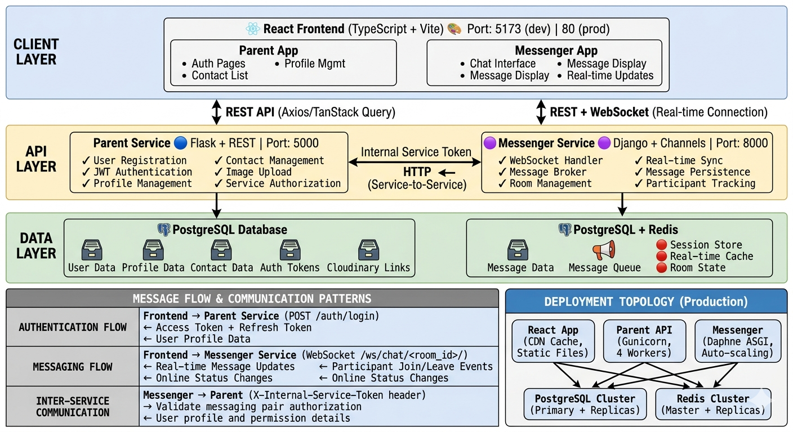
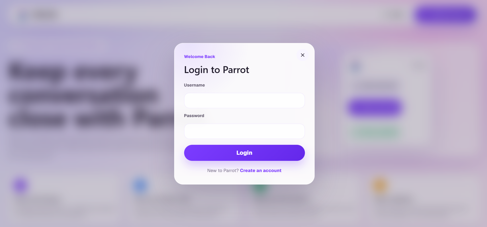
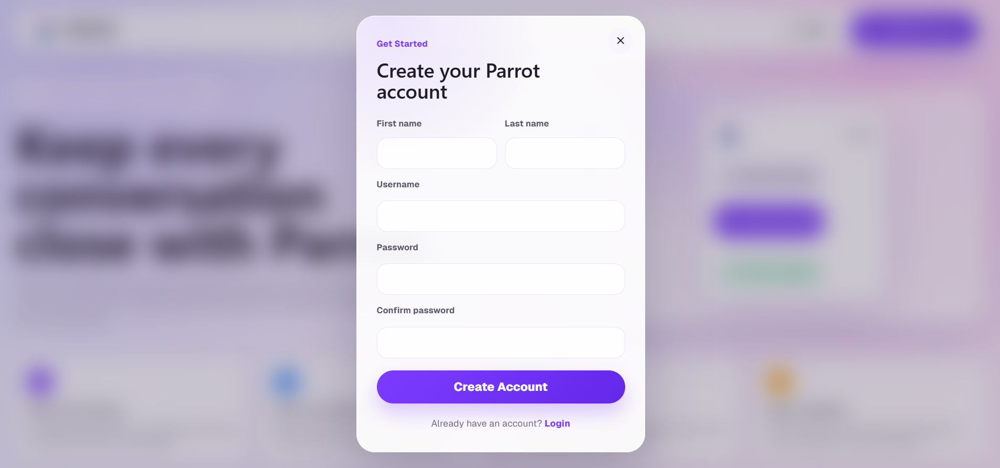

# Parrot - Unified Communication Platform

Parrot is a web communication platform with account management, saved contacts, direct and group chat, message replies, emoji reactions, message edit/delete for everyone, encrypted file attachments, browser-recorded voice notes, inline audio/video playback, encrypted stories, and browser-based end-to-end encrypted messaging.

**Try the app:** [https://parrot-react.onrender.com/](https://parrot-react.onrender.com/)

## Table Of Contents

- [About The App](#about-the-app)
- [Services](#services)
- [Architecture](#architecture)
- [Screenshots](#screenshots)
- [Main Features](#main-features)
- [Security Model](#security-model)
- [Frontend User Manual](#frontend-user-manual)
- [Create An Account](#1-create-an-account)
- [First Login And First Device Setup](#2-first-login-and-first-device-setup)
- [Login On Another Device](#3-login-on-another-device)
- [Recovery Key Updates](#4-recovery-key-updates)
- [Linked Devices](#5-linked-devices)
- [Direct Messaging](#6-direct-messaging)
- [Group Messaging](#7-group-messaging)
- [Stories](#8-stories)
- [Profile And Account](#9-profile-and-account)

## About The App

Parrot is a private messaging app for people who want a simple place to manage contacts, direct chats, group chats, and stories without giving the server readable access to their conversations. A user can create an account, save contacts by account number, send messages, reply to messages, react with emoji, edit or delete their own recent messages, send attachments, voice notes, audio, and video, see delivery/read updates, create contact-based groups, post encrypted stories, manage linked devices, and recover encrypted messages on another trusted browser with a recovery key.

The app is built around the idea that Parrot should help deliver and sync messages, but should not be the place where plain conversation text is kept. Messages are locked in the browser before they leave the user's device. The Messenger service stores the locked message data so conversations can load again later, but it does not receive the private keys needed to read those messages.

User conversations are stored by the Messenger service as encrypted message records. The service can keep direct and group room history, message status, unread counts, replies, emoji reaction keys, edit/delete metadata, group membership state, story audience records, device public keys, and recovery backup metadata. Message text is stored as encrypted content, not as readable chat text. Attachments, voice notes, audio/video files, and story media are also encrypted before upload; the encrypted files are stored in Cloudinary, and Messenger keeps the approved upload records and encrypted file references.

Account details are stored separately by the Parent service. Parent keeps login identity, profile details, saved contacts, aliases, block rules, ghost rules, and internal policy decisions for messaging, presence, receipts, groups, and story visibility. Parent does not store message text, message private keys, linked-device private keys, default-device passwords, or recovery keys.

User secrets are handled with separate protections:

- Login passwords are saved as password hashes, not plain passwords.
- The default-device password is checked by Messenger, but Messenger stores only its password hash.
- Private encryption keys stay in the user's browser/device. Messenger stores public keys so other devices can send encrypted messages to that user.
- The recovery key is created and checked in the browser. Messenger stores only the encrypted recovery backup and the data needed to verify it, not the plain recovery key.
- Non-default devices can use a recovery key to unlock old messages, but the app does not store or display the plain recovery key on those devices.
- Cloudinary API secrets and internal service secrets stay on the backend and are loaded from environment variables, not committed to the repository or sent to the browser.

## Services

The project is split into three services:

| Project | Role | Tech Stack | Repository |
|---|---|---|---|
| [`React/`](React/) | Browser frontend for login, profile, contacts, direct and group chat, replies, reactions, edit/delete actions, voice notes, inline media playback, stories, linked devices, and encrypted-message recovery. | React 19, TypeScript, Vite, Axios, React Router, Lucide icons, Tailwind CSS tooling, libsodium-wrappers | [Kishore-83096/parrot-react](https://github.com/Kishore-83096/parrot-react) |
| [`Parent/`](Parent/) | Account and contact service for login, profiles, JWT sessions, contact rules, blocking, ghosting, presence/receipt/story policy, group member resolution, and Messenger authorization. | Python 3.12, Flask, Flask-SQLAlchemy, Flask-Migrate, Alembic, Marshmallow, Flask-JWT-Extended, PostgreSQL/SQLite, Cloudinary, Gunicorn, Waitress, Docker | [Kishore-83096/Parent](https://github.com/Kishore-83096/Parent) |
| [`Messenger/`](Messenger/) | Messaging service for direct rooms, group rooms, stories, messages, reactions, edit/delete state, E2EE device keys, encrypted attachment/media uploads, delivery state, and WebSockets. | Python 3.12, Django, Django Channels, Redis, SQLite/PostgreSQL, Cloudinary, PyJWT, cryptography | [Kishore-83096/Parrot-messenger](https://github.com/Kishore-83096/Parrot-messenger) |

## Architecture

  

## Screenshots

| App | Login |
|---|---|
|  |  |

| Login Modal | Registration Modal |
|---|---|
|  |  |

| Chat | Chat Room |
|---|---|
|  |  |

## Main Features

- Parent account registration and login.
- Profile editing with profile-picture upload.
- Contact search by account number.
- Saved contacts with aliases, blocking, ghosting, unblocking, unghosting, and deletion.
- Direct messaging with replies, target-aware reply previews, emoji reactions, 15-minute edit/delete for everyone, delivery state, read state, and unread counts.
- Group messaging with group creation from saved contacts, group pictures, member management, admin/sub-admin roles, admin transfer, leave group, group replies, group reactions, group message info, read/delivered member status, and 15-minute edit/delete for everyone.
- Deleted messages are replaced by a deleted-message notice for the sender and recipients; encrypted Cloudinary attachments tied to the deleted message are removed on a best-effort basis.
- Edited messages show an edited indicator for sender and receiver/group members, and their delivery/read status is recalculated after the edit.
- Desktop hover actions and mobile tap actions for edit/delete/info/reply/reaction controls, plus mobile swipe-to-reply in either horizontal direction.
- Encrypted file attachment support for images, documents, audio, and video.
- Browser-recorded voice notes with a WhatsApp-style player, duration display, waveform, and encrypted upload.
- Inline audio/video playback in the conversation, with a maximize modal that continues from the current playback time.
- Text, image, and video stories with configurable 6, 12, or 24 hour expiry, all-contacts or specific-contact audience, viewers list, story reactions, story replies, and story deletion.
- Presence and inbox events through WebSockets.
- End-to-end encrypted messages using local browser keys.
- End-to-end encrypted group messages, group attachments, and story media.
- Linked-device management with a signed default-device security model.
- Recovery key backup and verification for encrypted-message recovery.

## Security Model

- Parent access and refresh tokens protect Parent APIs.
- Parent issues short-lived Messenger JWTs for Messenger APIs and WebSockets.
- Messenger asks Parent to authorize sends based on contacts, block state, and ghost state.
- Message content is encrypted in the browser before it is sent to Messenger.
- Emoji reactions are stored by Messenger as constrained reaction keys and counts, not as message text. The frontend maps those keys to the themed emoji UI.
- Encrypted attachments, voice notes, and audio/video media are uploaded directly from React to Cloudinary only after Messenger authorizes the message and returns short-lived signed upload intents. Cloudinary secrets stay on Messenger.
- Message deletes remove the visible message payload and try to remove related encrypted Cloudinary resources. A deleted-message tombstone remains in the room so replies, ordering, and audit context stay stable.
- Message edits are allowed only by the sender and only within 15 minutes. Messenger resets status and receipt state after an edit and re-applies Parent block/ghost policy before new delivery/read updates are shown.
- Group membership is resolved through Parent saved contacts, then stored in Messenger with admin, sub-admin, and member roles.
- Story audience and story-view visibility are resolved through Parent so blocked and ghosted contacts are handled consistently with chat presence and receipts.
- Messenger stores device public keys and encrypted message payloads; it does not receive message private keys.
- React queues outgoing messages in the browser and sends them to Messenger one at a time with unique client message ids, so fast sends keep first-come-first-serve order and duplicate retries stay safe.
- Realtime messaging uses both inbox and room websockets; the room socket is kept alive with pings, and the open conversation also accepts inbox message/status events as a fallback.
- React keeps an account-scoped UI cache for contacts, room list, selected conversation header data, and fetched conversation pages. The cache is refreshed by API responses and realtime events, and it is removed when that account logs out.
- Device management uses a separate local Ed25519 management key.
- The authenticated React app is mounted per account, so contacts, rooms, selected conversations, and runtime E2EE caches are discarded when a different account logs in on the same browser.
- Default-device actions are signed locally and verified by Messenger. Making a device default also requires the default-device password; Messenger stores only its password hash and rate-limits failed verification.
- Only the default linked device can update the recovery key. The default device can make another active device default with the password, and a non-default device can make only itself default with the password.
- Non-default devices can enter a recovery key for verification/recovery, but the app does not store or display the plain recovery key on those devices.
- Non-default device logout removes that device's Messenger database row and clears local E2EE browser state. Default-device logout keeps the default device row and local E2EE state so the same trusted browser can be recognized again.

## Frontend User Manual

### 1. Create An Account

1. Open the Parrot web app.
2. Choose register.
3. Enter first name, last name, username, password, and confirm password.
4. After registration, login with the username and password.

The Parent service creates the account, account number, login tokens, and profile record.

### 2. First Login And First Device Setup

On the first browser/device for a new account:

1. The app creates a local encrypted-messaging device identity.
2. The device is registered with Messenger.
3. Because no default device exists yet, the app opens linked-device setup.
4. Create the default-device password and make this device default.
5. Create a recovery key.
6. Save the recovery key somewhere outside the browser.

The first default device is important because it becomes the only device allowed to manage recovery-key updates. The default-device password is required later if default permission is moved to another trusted browser.

### 3. Login On Another Device

When the same account logs in on another browser/device:

1. The app creates/registers a new device identity.
2. If a recovery backup exists, the app asks for the recovery key.
3. The user gets 5 attempts.
4. If all attempts fail, the app logs out and clears local E2EE browser state.
5. If recovery succeeds, old encrypted messages can decrypt on that device.
6. The device remains non-default unless the user enters the default-device password to make that current device default, or the current default browser makes it default.
7. When the non-default device logs out, its Messenger device row and local E2EE browser state are deleted.

Non-default devices can read messages after recovery, but cannot view/update the recovery key or manage other devices.

### 4. Recovery Key Updates

When the default device updates the recovery key:

1. Messenger broadcasts a `recovery.key_updated` event to the user.
2. Other linked non-default devices fetch the encrypted backup.
3. They open a modal asking for the current recovery key.
4. The key is verified locally against the encrypted backup.
5. The key is discarded and only a local acknowledgement marker is stored.

This prevents non-default devices from showing or retaining the plain recovery key.

### 5. Linked Devices

Open the account menu and choose linked devices. The device tab separates the current default device at the top from active devices below it. On the default browser, it shows all active linked devices. On a non-default browser, it shows the current browser and the current default browser.

Default device can:

- make another active device default after password verification
- update the default-device password after current-password verification
- remove another non-default device
- update the recovery key
- view the locally saved recovery key if it exists on that browser
- log out without removing its local E2EE identity or Messenger default-device row

Any current device can:

- log itself out
- make itself default after password verification
- verify the recovery key when prompted

Non-default devices cannot:

- view the recovery key
- update the recovery key
- revoke other devices
- make another device default

Non-default logout is a cleanup action: React clears that browser's E2EE local storage and Messenger deletes that device row from the database. This keeps the linked-device list clean when the same user logs in again from the same browser.

### 6. Direct Messaging

1. Open the contacts tab.
2. Search a Parrot account number.
3. Save the contact with an alias.
4. Open a contact or chat from the left panel.
5. Send text, attachments, voice notes, audio, or video.
6. Reply to messages from the reply action, or swipe either direction on mobile to select a message as the reply target.
7. React to messages with the five supported emoji reactions. On desktop, hover the message bubble to show edit, delete, reaction, and reply controls. On mobile, tap the message bubble to show those controls beside the message.
8. Edit or delete a message you sent within 15 minutes. The app checks the message timestamp before submitting; if the window has expired, the modal opens with a timeout message instead of allowing the action.
9. Send repeatedly if needed; React queues outgoing messages and sends them first-come-first-serve.
10. Use the room header for contact details, alias editing, blocking, ghosting, unblocking, unghosting, release of blocked messages, or contact deletion.

Messages and attachment payloads are encrypted in the frontend before being sent through Messenger. Attachments use signed upload intents: Messenger authorizes the recipient first, React uploads encrypted blobs directly to Cloudinary, then Messenger verifies the Cloudinary response before the message can reference the completed upload.

Voice notes use the browser microphone and MediaRecorder API, then go through the same encrypted attachment flow as files. No third-party voice API is required. Voice-note metadata such as duration and waveform is stored inside the encrypted message payload, while Messenger only sees encrypted upload records. Normal single audio/video attachments can play inline in the message room; the maximize button opens the media modal at the same playback time instead of restarting.

Replies keep a preview inside the message bubble. Reply previews are styled by the message being replied to: replies to sent messages use a blue preview treatment, and replies to received messages use a white preview treatment. Emoji reactions are displayed as small emoji-only markers on the message bubble edge and update in real time through Messenger events.

Contacts, chat rooms, conversation headers, and already fetched message pages open from the local account cache first, then refresh from the APIs and WebSockets. This makes mobile and desktop views feel instant after navigation or reload while still keeping Messenger as the source of truth. Logging out clears that account's messenger UI cache from the browser.

### 7. Group Messaging

1. Create a group from saved contacts and set a group name.
2. Optionally upload a group picture.
3. Send encrypted text, files, voice notes, audio, video, replies, and reactions to active group members.
4. Use the message info icon on group messages to view reactions and member read/delivered status.
5. Edit or delete your own group message for everyone within 15 minutes. Deleted group messages show a deleted-message notice to all members and remove linked encrypted media when possible.
6. Admins and sub-admins can update the group name/picture and add or remove members. Admins can promote/remove sub-admins, transfer admin, delete the group, or leave after transferring admin.

Group message controls follow this order beside a message: edit, delete, info, reactions, and reply. When a group is deleted, the room becomes read-only.

### 8. Stories

1. Open the stories panel from the messenger area.
2. Create a media story with one encrypted image or video, or create a text story with a selected theme.
3. Choose expiry: 6, 12, or 24 hours.
4. Choose visibility: all saved contacts or specific contacts.
5. View your own stories, open the viewers list, or delete a story.
6. View contacts' stories, reply to them, or react with the same five emoji reactions used in chat.

Story media is encrypted before Cloudinary upload. Story replies and reactions become direct messages with story context, so they appear in the related direct chat while the story itself remains governed by its audience and expiry rules.

### 9. Profile And Account

The account menu supports:

- profile viewing and editing
- profile-picture upload
- password change
- account deletion
- linked-device and recovery-key management
- logout
